<picture>
  <source media="(prefers-color-scheme: dark)"  srcset="./assets/header-dark.svg">
  <source media="(prefers-color-scheme: light)" srcset="./assets/header-light.svg">
  
</picture>

<picture>
  <source media="(prefers-color-scheme: dark)"  srcset="./assets/stats-dark.svg">
  <source media="(prefers-color-scheme: light)" srcset="./assets/stats-light.svg">
  
</picture><picture>
  <source media="(prefers-color-scheme: dark)"  srcset="./assets/languages-dark.svg">
  <source media="(prefers-color-scheme: light)" srcset="./assets/languages-light.svg">
  
</picture>

<picture>
  <source media="(prefers-color-scheme: dark)"  srcset="./assets/heatmap-dark.svg">
  <source media="(prefers-color-scheme: light)" srcset="./assets/heatmap-light.svg">
  
</picture>

### `❯ cat about.md`

Entrepreneur. I travel a lot, cook a lot, eat a lot and mess about with whatever is new.

I find new things early and I like building things nobody has to approve first.

So now I ship solo, and the agents do most of the typing.

### `❯ cat stack.txt`

`Claude Code` `Codex CLI` `MCP` `TypeScript` `Next.js` `Supabase`
`Swift` `AppKit` `Rust` `Python` `Postgres` `Ghostty` `tmux`

### `❯ whereis salexandr0s`

Switzerland · [savorg.xyz](https://savorg.xyz)

---

**About these cards.** No third-party widget services — every card above is generated by
[`scripts/`](./scripts) straight from the GitHub GraphQL API, committed as SVG, and refreshed
daily by [a GitHub Action](./.github/workflows/refresh.yml). They embed a subsetted
[JetBrains Mono](https://github.com/JetBrains/JetBrainsMono) ([OFL](./assets/fonts/OFL.txt))
so the type renders identically everywhere, and ship in both themes.

The stats card counts private contributions, which is why it reads ~1,850 rather than the ~560
a public-only widget can see. It reads aggregate totals only — never repository names or code.

